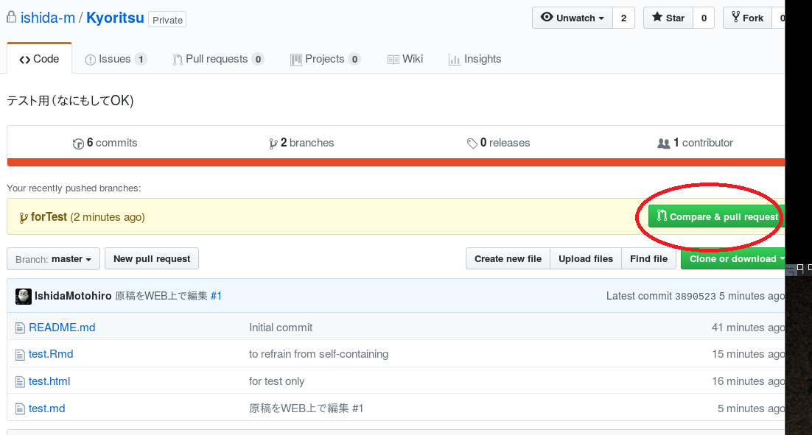
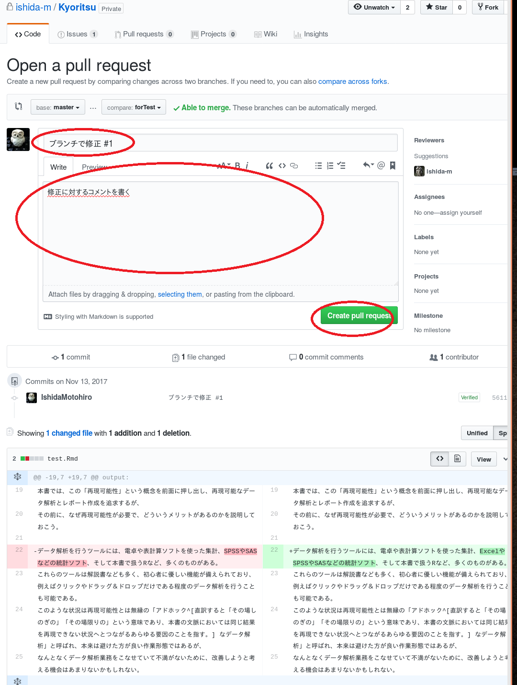

# WorderfulR編集手順
石田基広  
2017年11月13日  

## レポジトリの確認

例えば高橋康介先生の原稿であれば https://github.com/IshidaMotohiro/RStudiooo ここにある。

左の [Branch: master] というボタンを押すと [Kyoritsu] という項目があるのでこれをクリックして選ぶ。
このレポジトリにある拡張子ｍｄファイルを編集してもらう。方法は以下の通り。

- ファイル名をクリックする
- ウィンドウ右上に鉛筆マークがあるので、クリック
- ファイルに直接変更を加える。取り消し線などは不要
- 終了したら下の Commit change 欄の上に変更の概要、下には、より詳細なコメントを書く
- Commit Chagens ボタンを押す

ファイル閲覧ウィンドウに戻るので、左上の [Branch: Kyoritsu]  ボタンを押して [master] 　に変更する。変更があった旨を表す黄色いラインが現れているはずなので、右の [Comnpare & pull request] をクリック。

修正の検討を依頼するウィンドウに移動するので、ここで変更の概要と、その詳細コメントを書いて [Create Pull request] ボタンを押す。

以上。これで変更の通知と検討依頼（プルリクエスト）が著者にいく。

## 別のファイルを編集した場合の注意

続けて別のファイルを編集する。ただし、先に送った変更依頼の処理を著者サイドでまだ終えていない場合、次のファイルの編集を終えて [Commit change] を押して [Branch: master] に戻っても、変更を表す黄色いラインは現れていないかもしれない。
ただし、この場合でもふたつ目以降のファイルに対するプルリクエストは送信されているので心配はない。

過去のプルリクエストがすべて処理されているタイミングで、新たに [Branch: Kyoritsu] にあるファイルを編集して　[Commit Change] して [Branch master] に戻ると、上の図にあるような変更を表す黄色いラインが現れているはずなので、その場合は再び [Create Pull request] の処理を行う。

